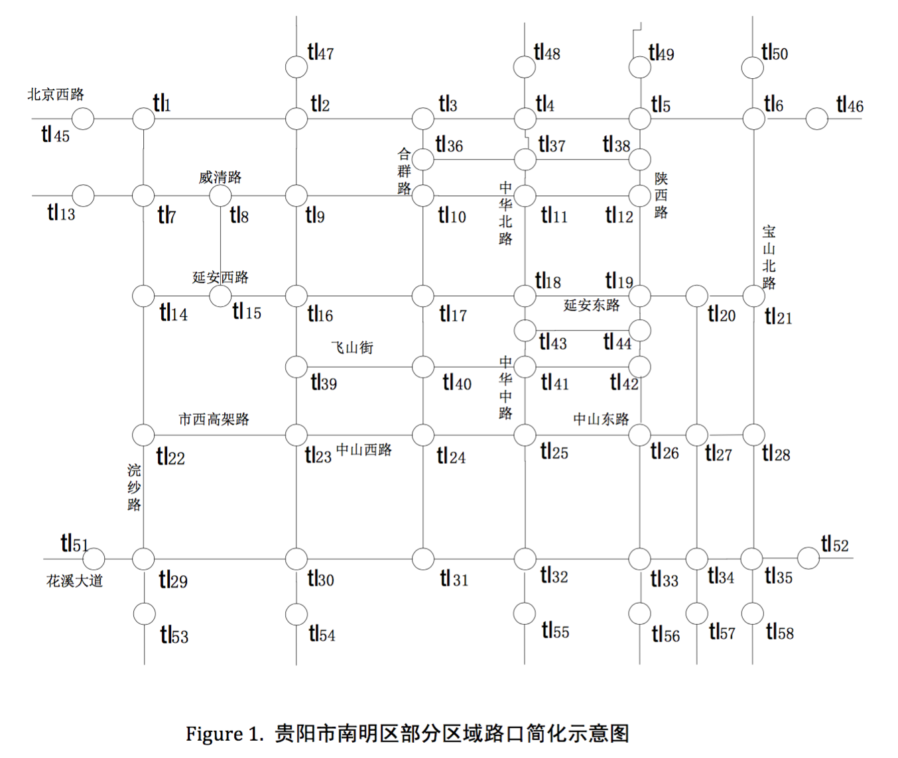
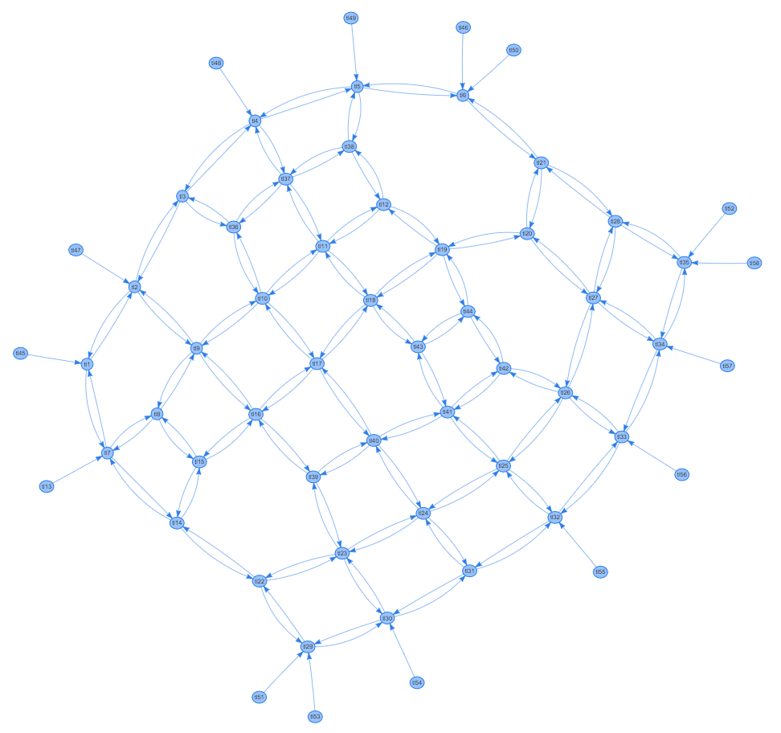
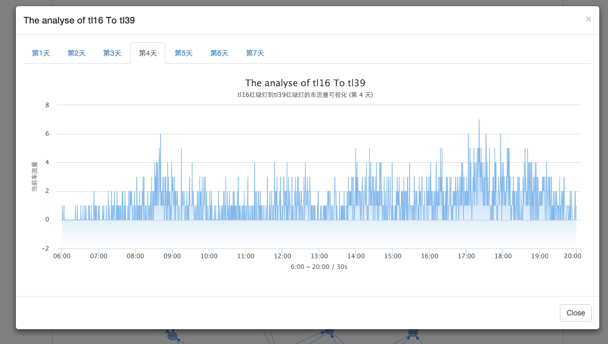

# traffic-visualization
创新实践 - 基于阿里交通数据竞赛的可视化实践
[http://blackganglion.github.io/traffic-visualization/](http://blackganglion.github.io/traffic-visualization/)

## 技术要点

* **Node** 完成数据的提取与分离

* **vis.js** 完成网络图的构建与渲染

* **bootstrap** 完成模态框与标签页

* **highcharts** 完成基于时间轴的流量曲线图

## 原始数据的提取与分离

* 原始数据描述

```
├── initialData/
│   └── flow0901.txt
│   └── flow0902.txt
|   └── flow0903.txt
|   └── flow0904.txt
|   └── flow0905.txt
|   └── flow0906.txt
|   └── flow0907.txt
```

共7份数据文件，代表7天的车流量数据。

每一份数据中, 按行划分, 以行为单位，为红路灯tlx到红路灯tly的车流量，从早上6:00到晚上20:00，共14小时，
每30s统计一次，14 * 60 * 60 / 30 = 1680

**TrafficLightID(当前红路灯) FromID(来源红路灯) traffic_flow_1 traffic_flow_2 ... traffic_flow_1680(1680个车流量数据)**

* 原始数据提取

利用Node异步I/O的特性，使用Promise与eventproxy控制并发，同时读取与分析7份原始数据文件，提取**TrafficLightID**
与**FromID**，采用两个map容器，一个用来存储node，一个用来存储相应的edge，同时去除重合的node与edge

* 原始数据分离

在提取的同时，将数据按天按form-to分离存储，比如: 第1天tl1到tl2的车流量数据存储为 api/data/1/tl1tl2.json

## 交通网络图的构建与渲染




获得相应nodes与edges后，利用vis.js来构建与渲染网络图，可参见[原始demo](http://visjs.org/examples/network/edgeStyles/arrows.html)

为实现下一步点到点流量图的构建，需要在每条edge上增加点击事件，vis.js的点击事件是这样的，当点击到相应edge上时回调
函数只能获取到该条edge的UUID，当然这个ID是唯一的，以此来区分不同的edge。而我们需要获取的是相应edge的两个node节点，
在new vis.DataSet时，需要建立一个map，以UUID为键名，{from, to}为键值，在点击事件发生获取到UUID后，利用这个map便
可以获取到from和to节点的id。

## 点到点流量图的构建与渲染



根据day、from节点id、to节点id，获取api文件夹中的对应json，利用hightcharts渲染生成流量图，可参见[原始demo](http://code.hcharts.cn/demos/hhhhx1)
